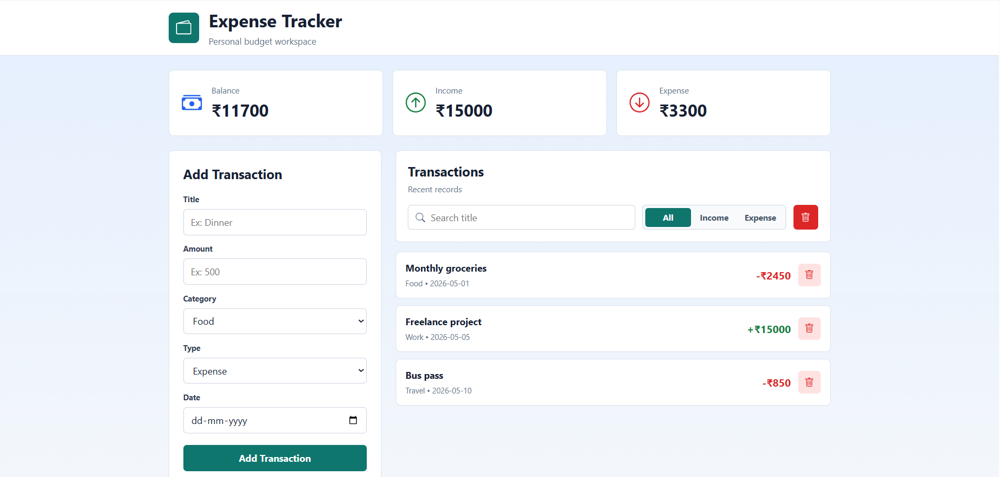

# 💰 Expense Tracker

A modern and responsive **Expense Tracker Web Application** built using **React JS**.  
This project helps users manage their income and expenses efficiently with an attractive dashboard UI, charts, and responsive layouts.

---

# 🚀 Live Features

## ✅ Core Features

- Add income and expense transactions
- Delete transactions
- Track total balance
- Income & expense summary
- Expense categories
- Expense analytics charts
- Local Storage data persistence

---

# 📱 Responsive Design

This project is fully responsive and works smoothly on:

- 📱 Mobile Devices
- 💻 Laptops
- 🖥️ Desktop Screens
- 📟 Tablets

### Responsive Features

- Responsive Navbar
- Mobile-first layout
- Flexbox & CSS Grid layouts
- Proper spacing and alignment
- No broken UI on smaller screens

---

# 🎨 Clean UI/UX Design

### UI Features

- Modern dashboard interface
- Professional color palette
- Consistent spacing
- Attractive cards and buttons
- Modern typography
- Clean and minimal design

### UX Improvements

- Smooth navigation
- User-friendly layout
- Simple interaction flow
- Hover effects

---

# ✨ Animations & Interactions

- Smooth hover effects
- Framer Motion animations
- Smooth transitions
- Interactive dashboard cards
- Loading skeletons

---

# ⚡ Performance Optimization

- Lazy loading components
- Optimized assets/icons
- Efficient rendering
- Fast loading UI

---

# 🛠️ Tech Stack

## Frontend

- React JS
- CSS / Tailwind CSS
- JavaScript (ES6+)

## Libraries Used

- Recharts
- Framer Motion
- React Icons

---

# 📂 Folder Structure

```bash
src/
 ├── components/
 ├── pages/
 ├── assets/
 ├── hooks/
 ├── utils/
 ├── App.jsx
 └── main.jsx
```

---

# 📦 Installation & Setup

## Clone the Repository

```bash
git clone https://github.com/AllemSamyel-03/Expense-Tracker.git
```

## Navigate to Project Folder

```bash
cd ExpenseTracker
```

## Install Dependencies

```bash
npm install
```

## Run Development Server

```bash
npm run dev
```

---

# 🌟 Future Improvements

- Authentication System
- Export Reports
- Monthly Budget Tracking
- Dark/Light Theme Toggle
- Backend Integration
- Cloud Data Storage

---

# 📸 Screenshots

### Expense Tracker

## 

# 📌 Project Highlights

✅ Responsive Design  
✅ Clean UI/UX  
✅ Beginner to Intermediate Level Project  
✅ Real-world React Project  
✅ Internship Ready Project

---

# 👨‍💻 Author

Developed by **ALLEM SAMYEL**

GitHub: https://github.com/AllemSamyel-03

Linkedin: https://www.linkedin.com/in/allem-samyel-039655374/

---

# 📄 License

This project is licensed under the MIT License.
